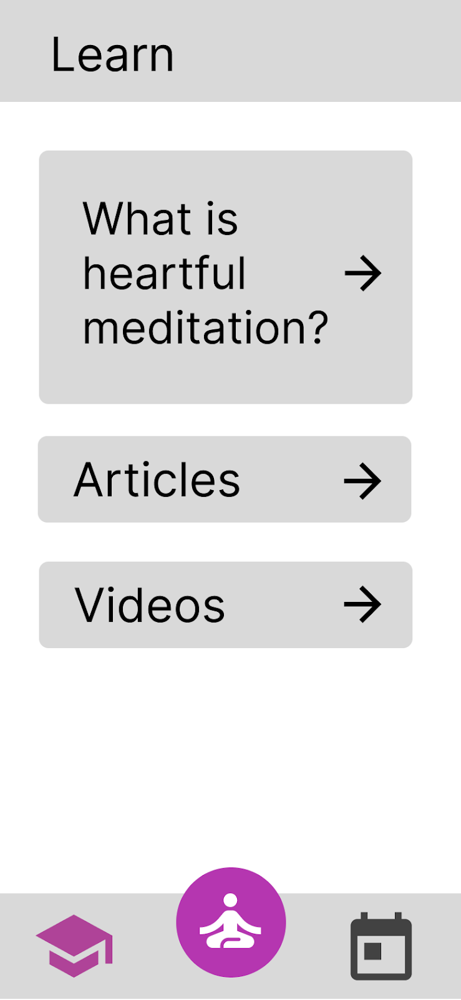
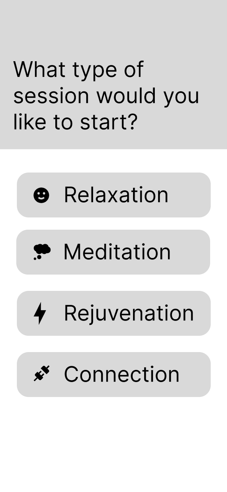
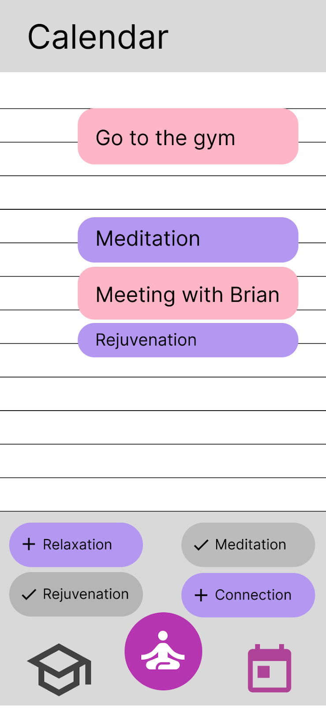

# Heart at Work

[View the slideshow here!](https://docs.google.com/presentation/d/1npBF1yddgTRr_9WsixVrSul5AKa_p4kEd4wlaw207y8/edit?usp=sharing)

## Presentation script

Life is hectic! Especially if you’re founding a silicon valley startup. There are thousands of productivity apps to help with this - so why are people still consistently overwhelmed? These apps might try to bring order to our external responsibilities and goals, but I believe they might fail to bring us a true sense of peace because they’re forgetting one crucial thing: the heart.

There is a simple system of meditation and relaxation called Heartfulness, which connects people and helps them get in touch with their inner divine self. It’s a daily practice that goes back centuries and stems from Raja Yoga. It brings calm to our busy lives, from the inside instead of the outside. While there are apps to help people practice Heartfulness, busy people might still feel like they can’t work it into their schedule.

Hi, my name’s Roman Hauksson, and to solve this problem, I’ve designed Heart at Work, a one-of-a-kind productivity app that integrates with your calendar to make it trivial to plan Heartfulness meditation sessions.

When you first start the app, you'd be greeted by with links to helpful resources you can use to learn about Heartfulness meditation.

Clicking the middle button brings up a screen where you can begin a meditation session. As you can see, Heartfulness involves four daily practices: relaxation, meditation, rejuvenation (or cleaning), and inner connection.

Finally, clicking on the calendar icon from the home screen shows us what makes Heart at Work unique. Here, you can see an overview of your day, with events that are synced from other apps, like Google Calendar.

Some of the productivity nerds in the room might know about timeboxing: a time management method where you plan ahead of time what periods you will get certain tasks done, to add structure to your day and ensure tasks don’t get out of hand. I believe that this is the key to getting busy people to give heartfulness meditation a try. The user can squeeze meditation sessions around their pre-existing schedule by tapping each of the four buttons near the bottom and adjusting the start and end times.

Heart at work would come with other helpful features like notifications for the daily Universal Prayer, when people in different geographic locations connect by meditating at the same time. It would also allow you to see an overview of how often you’ve achieved each of the daily practices in previous days, to help build the habit.

I want to help you bring a deeper sense of order to your busy life with Heart at Work. Thank you!
